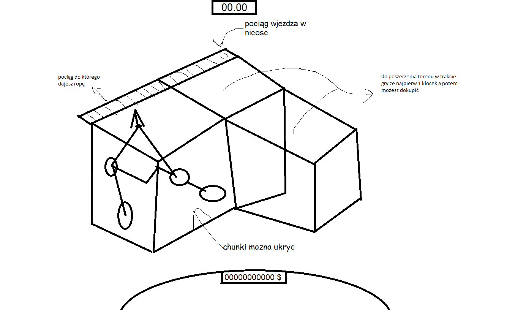

# Petrol Fever
Jesteśmy Ignacy Łukasiewicz (wynalazcą ropy naftowej) i wydobywamy ropę.
Widok izometryczny.
#### Prowizoryczny Koncept Gameplay loop:
  1. Znajdujesz ropę pod ziemią.
  2. Stawiasz wiertło
  3. podłączasz wiertło rurami do ropy
  4. wydobywasz Ropę
  5. kupujesz węgiel do pociągu 
  6. wysyłasz pociąg
  7. sprzedajesz u klienta
  8. ulepszasz sprzęt
  9. kupujesz nowe chunki
  10. Profit
---

## Koncept i status zaimplementowania Mechanik
#### Wydobywanie Ropy:
- [ ] wyszukiwanie ropy za pomocą ludzi z patykami albo jeleni
- [ ] jest gościu z wiertłem który odkrywa pasek terenu w dół 
- [ ] wydobywanie ropy pompami
- [ ] długość rury ograniczona można powiększyć ilością pomp/ulepszeniami
#### Chunki:
- [ ] 10% szansy że kupiony chunk będzie mial jezioro pod ziemią i trzeba będzie wodę wypompować
- [ ] złoza ropy generowane losowo
- [ ] możliwość kupienia nowych chunków max 6
- [ ] 10-25% szansy że chunk będzie mial w niektórych miejscach twardą skałę i trzeba będzie użyć twardszego wiertła żeby się przewiercić 
- [ ] możliwość podniesienia chunków w górę aby lepiej widzieć inne
#### Pociąg:
- [ ] pociąg jadacy do miasta zasilany węglem
- [ ] pociąg jezdzi okresloną ilosc czasu do miasta, którą można przyspieszyć ulepszeniami albo zużywając więcej węgla 
- [ ] możliwość ulepszenia pociągu Zwiększając jego pojemność
#### Sprzedaż Ropy:
- [ ] kupowanie wegla i sprzedawanie ropy po zmieniających się cenach
- [ ] klient bedzie mial niższe ceny im więcej u niego sprzedajemy
- [ ] są rozni klienci, którzy będą mieć coraz wyższe ceny jeśli będziemy z nim współpracować
- [ ] jest giełda gdzie można przekonac kogoś do kupienia ropy żeby podnieść cenę 

---
## Epickie i potężne koncept arty:
| Widok Chunków | Widok Miasteczka |
| --- | ---|
| </img> | </img>
| </img>

